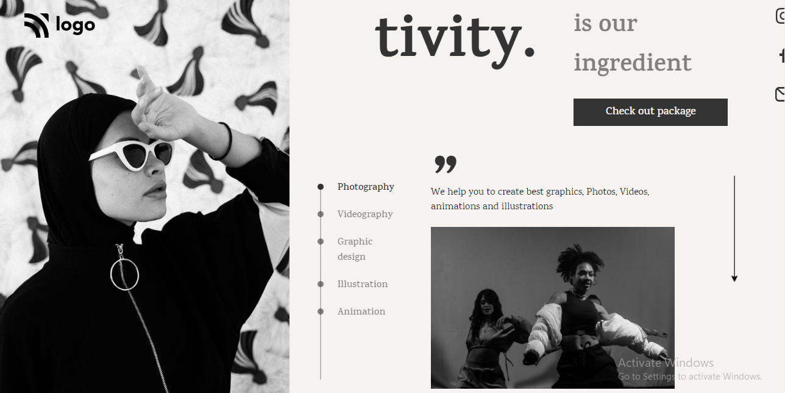

# Mukul Basu

## Project 14

[Video Demo](https://vimeo.com/741061076/fbe18b7944)

## Important Things learnt 
1. Refreshed concepts of CSS positioning
2. Use of :root keyword, use of web toolkit to make the hollow text effect
3. extensive use of flex

## Honest Time to finish this project

Took around **3 hrs**

## Focus Learning
- Flexbox, Webkit, variables 

## Live link

[Project Link](https://project14.vercel.app/)

